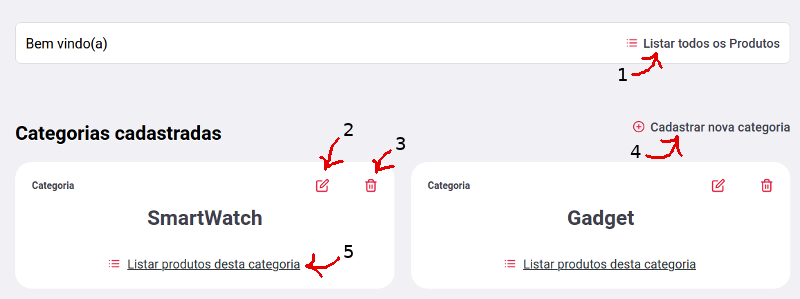

<h1 align="center">Prova Desafio - <a href="https://ledgertec.com.br/">LedgerTec</a></h1>

> Prova desafio para a seleção de estagiário bolsista (Full-Stack) - 05/2020. 

***

## Sobre a LedgerTec
**Empresa especializada em Gestão de Documentos Digitais.**

> Fornecemos tecnologias para integridade digital em todo o ciclo de gestão de documentos digitais relevantes garantindo a continuidade, fixidez e autenticidade de objetos e ativos digitais, além de permitir a produção de provas de sua existência, propriedade e/ou autoria com validade jurídica.

<details><summary><b>Produtos</b></summary>
  
* **LedgerDoc** - Painel de Gestão Integrada de Documentos Digitais
* **LedgerSign** - Coletor de Assinaturas Digitais Web e Desktop
* **LedgerCheck** - Portal/API de Validação de Assinaturas Digitais
* **LedgerChain** - Serviço de Registro em Múltiplas DLTs (blockchain)
* **LedgerGuard** - Serviço de Preservação Digital de Longo Prazo
* **LedgerPKI** - SDK completo para assinaturas ICP-Brasil
* **LedgerDiD** - Serviço de Gestão de Identidades Digitais Centralizadas, Descentralizadas e Híbridas
</details>

<details><summary><b>Serviços</b></summary>
  
* **Projetos Específicos** - Projeto e integração de recursos para integridade digital em soluções novas e/ou existentes.
* **Fábrica de Software** - Desenvolvimento, manutenção e suporte de soluções customizadas aplicando certificação digital, preservação digital e/ou blockchain.
* **Transferência de Conhecimento** - Treinamento e Consultoria em certificação digital, preservação digital e blockchain.
</details>

###### Para mais detalhes acesse [ledgertec.com.br](https://ledgertec.com.br/)

***

## Sobre o Desafio
O desafio é dividido em duas partes, sendo a primeira parte focada no backend e a segunda focada no frontend:
1. Criação de uma API RESTful com NodeJS para CRUD de produtos.
    * [Lista de requerimentos do desafio 1](https://github.com/Vitor-Felix/ledgerTec-CRUD-API-WebApp/issues/1)
2. Criação de Aplicação Web para Gestão de Produtos.
    * [Lista de requerimentos do desafio 2](https://github.com/Vitor-Felix/ledgerTec-CRUD-API-WebApp/issues/2)

###### Início: 18/05/20 - Deadline: 28/05/20

***

## API
> Todos os arquivos da API estão dentro da pasta backend.

A API se trata de 11 requests REST que fazem queries no banco de dados, para operações de CRUD e listagens para as entidades Produto e Categoria.

#### Originalmente no projeto são requeridas 6 requests:

* Listar todos os Produtos;
  * `GET http://localhost:9099/produtos`
* Selecionar um Produto por seu id;
  * `GET http://localhost:9099/produtos/{produtoId}`
* Criar um novo Produto;
  * `POST http://localhost:9099/produtos`
* Atualizar um Produto;
  * `PUT http://localhost:9099/produtos/{produtoId}`
* Deletar um Produto;
  * `DELETE http://localhost:9099/produtos/{produtoId}`
* Listar todos os Produtos de uma Categoria (requerido mais tarde no front-end).
  * `GET http://localhost:9099/categoria/{categoriaId}/produtos`

#### Porém para facilitar o tratamento e visualização dos dados, foram também implementadas as rotas:

* Listar todas as Categorias;
  * `GET http://localhost:9099/categorias`
* Selecionar uma Categoria por seu id;
  * `GET http://localhost:9099/categorias/{categoriaId}`
* Criar uma nova Categoria;
  * `POST http://localhost:9099/categorias`
* Atualizar uma Categoria;
  * `PUT http://localhost:9099/categorias/{categoriaId}`
* Deletar uma Categoria;
  * `DELETE http://localhost:9099/categorias/{categoriaId}`

### API Documentation com Postman Collections
Foram criadas duas collections no [Postman](https://www.postman.com/) com especificações mais detalhadas sobre as rotas e exemplos pré-definidos. 

> Estes arquivos estão na raiz pasta backend!
* `Product.postman_collection.json` - Requerido no desafio, apenas com as rotas sobre Produtos.
* `CategoriaProduto.postman_collection.json` - Com todas as rotas implementadas.

### Banco de Dados com Sequelize
Para a implementação de banco de dados foi exigido o uso do SQLite, porém a ferramenta de acesso ao banco era de livre escolha. Para se comunicar com o banco de dados, foi escolhido o [Sequelize](https://sequelize.org/) como ferramenta de ORM.

Como este projeto é apenas uma POC para demonstar o uso de tecnologias e frameworks, o banco de dados foi deixado no repositório para casos de testes rápidos da aplicação, com alguns dados pré-preenchidos.

Caso se queira deletar o banco de dados e gerar um novo com as `seeds`, basta seguir as intruções a baixo:

<details><summary><b>instruções para utilizar migrations e seeds</b></summary>
  
1. Dentro da pasta backend, execute o `sequelize-cli` para fazer as migrações.
```console
foo@bar:~$ npx sequelize-cli db:migrate
```
2. Para semear o banco de dados com alguns dados pré-definidos, execute:
```console
foo@bar:~$ npx sequelize-cli db:seed:all
```

</details>

### Casos de Teste com Jest
Foi exigida a implementação de testes para cada rota (5 rotas para tratamento de Produto), utilizando a framework de testes [Jest](https://jestjs.io/).

Para executar os testes, basta utilizar o script `test` do npm.
```console
foo@bar:~$ npm test
```
> ATENÇÃO: Não excluir o banco de dados `dbTest.sqlite3` em `backend/database/dbTest.sqlite3`!!!

<details><summary><b>Por que não devo deletar o arquivo dbTest.sqlite3 ?</b></summary>
  
  > Se trata de um pequeno reparo rápido que acabou sendo esquecido e não pôde ser devidamente
  implementado em tempo hábil antes da data limite de entrega. 
  
  #### Qual foi o problema?
  Ao se executar `npm test` o banco de dados apenas ia juntando mais dados. A solução seria apenas
  remover as tabelas e inseri-las novamente ao início de um novo teste.
  
  #### Motivo do crime
  Devido esta simples tarefa de remover e reinserir tabelas no teste ter despendido muito tempo, 
  fiquei com medo de gastar tanto tempo em uma tarefa tão simples e não dar tempo de implementar as
  tarefas realmente requeridas do projeto.
  
  #### POG - Programação Orientada a Gambiarra 
  Como eu simplesmente precisava deletar o banco de dados e gerar novas tabelas vazias, apelei para 
  os sripts do node. Dentro do arquivo `package.json` aproveitei o script `test` e fiz isso lá mesmo:
  ```JSON
  "scripts": {
    "test": "rm ./database/dbTest.sqlite3 && npx sequelize-cli db:migrate --env test && cross-env NODE_ENV=test jest"
  },

  ```

</details>


## Aplicação Web 
> Todos os arquivos da Aplicação Web estão dentro da pasta frontend.

Resumindo toda a tarefa, pode-se dizer que esta se tratava basicamente de criar uma aplicação web com [React](https://reactjs.org/), para a gestão de Produtos. Em outras palavras, criar páginas dinâmicas para o uso 
das funcionalidades disponibilizadas pela API posteriormente criada.

Tal como na API, seriam implementadas algumas páginas apenas para as 6 rotas do projeto. 
Porém também foram implementadas as mesmas funcionalidades para a entidade Categoria.

> Todo o projeto foi fortemente baseado no projeto `Be The Hero` desenvolvido pela 
[Rocketseat](https://rocketseat.com.br/), durante a 11ª edição da semana OminiStack. Porém o layout em especial,
é praticamente o mesmo, com algumas poucas mudanças para a adequação ao desafio. A parte mais significativa das 
mudanças está na dinamização das páginas. Embora o projeto seja excluído após a semana Oministack, ainda é possível se encontrar repositórios clones muito bem detalhados, como este [aqui](https://github.com/christyanbrayan/be-the-hero/blob/master/README.md).

Como as telas são muito similares, vou apenas mostrar os dois tipos básicos de telas que possuem apenas algumas adequações
a entidade à qual elas se referem.

### Lista Produtos/Categorias
<p align="center">  </p>

1. **Listar todos os Produtos** - Redireciona para uma página similar a esta, mas com Produtos ao invés de categorias. Cada Produto/Categoria é um card.

2. **Atualizar Produto/Categoria** - Seleciona a instância do Produto/Categoria do card escolhido e redireciona para a tela de atualização.

3. **Deletar Produto/Categoria** - Seleciona a instância do Produto/Categoria do card escolhido e exibe caixa de confirmação para deleção. Se confirmado, a instância é excluída e o card some.

4. **Cadastrar Produto/Categoria** - Redireciona para a página de criação de novo Produto/Categoria.

5. **Listar todos os Produtos de uma Categoria** - Redireciona para uma página similar a esta e exibe de qual Categoria são os Produtos listados.

### Cadastra/Atualiza um Produto/Categoria
<p align="center">  </p>

Ao se clicar em `Cadastrar novo Produto` o usuário é redirecionado para esta tela. O layout muito similar
para as telas de `Cadastro de nova Categoria`, `Atualizar Categoria` e `Atualizar Produto`.

Para os casos de `Atualizar Categoria` e `Atualizar Produto`, os campos vem pré-preenchidos com seus últimos valores 
cadastrados no banco de dados.

---

<h4 align="center"><i>That's All Folks</i></h4>
